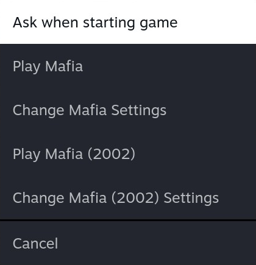
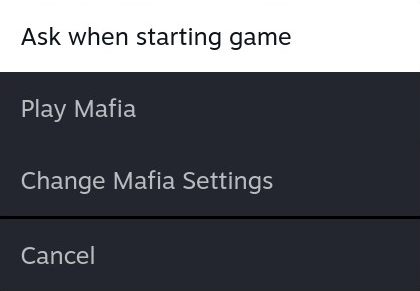
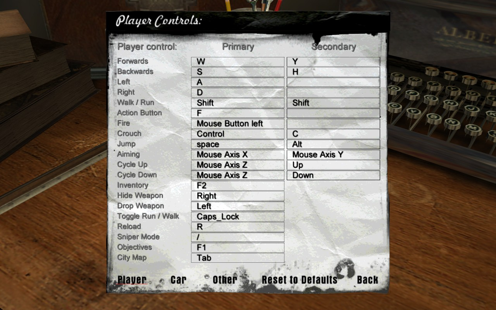
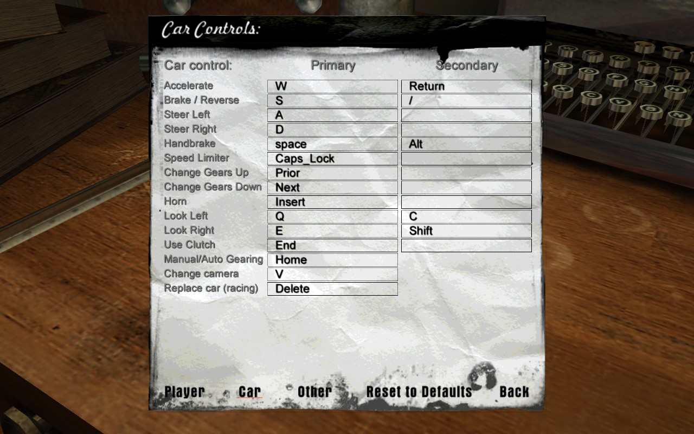
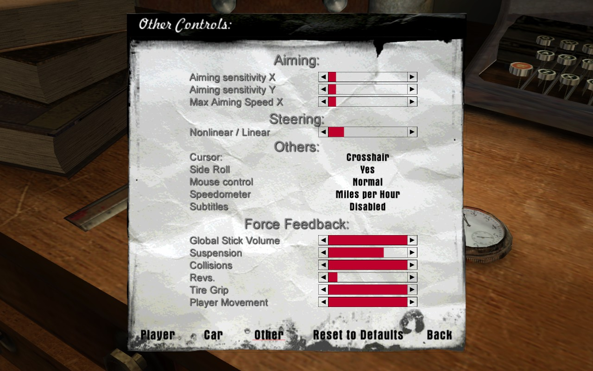
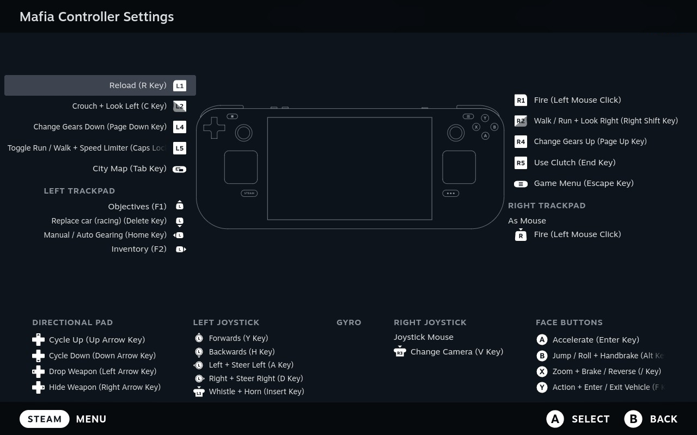

# Mafia

## Install Guide - Steam Deck

This guide outlines how to install the Steam version of Mafia on a factory reset Steam Deck, with fixes that restore the original soundtrack and address graphical issues, including a fix for HUD stretching, enhancements to draw distance and field of view etc. A control scheme based on the PS2 configuration is also provided below to accommodate Steam Deck/Controller input, while preserving keyboard and mouse as an option for docked play. Note that there may be steps that aren't applicable if you have already installed Mozilla Firefox and ProtonUp-Qt.

There are four different versions of Mafia on PC:
- PC CD-ROM
- GOG
- Steam (2002)
- Steam (2017)

The PC CD-ROM version of Mafia runs into problems on SteamOS, where disc 2 is not recognised during the installation process.

However, the GOG release provides a suitable replacement for preservation purposes, as offline installers can be downloaded to install the game with the latest 1.3 patch from 2017. Patch 1.3 comes with one caveat though, as it cuts a substantial amount of the game's original soundtrack due to copyright, but this can be rectified with files from the original release.

|    |    |
|:-------------------------------------------------:|:-------------------------------------------------:|
|**Figure 1**&emsp;2002 version                     |**Figure 2**&emsp;2017 version                     |

This copyright issue also explains why you may have access to 2 different builds of the original Mafia game on Steam, provided you purchased it before 2017 when the copyright changes were implemented. To identify which version you own:
- In Gaming Mode, press `STEAM`
- Select `Library` > `ALL GAMES` > `Mafia` > `Manage` > `Properties...`
- In `General` > `Launch Options` > Open `Selected Launch Option`:
    - Figure 1 shows a Steam account with access to both the 2002 and 2017 builds of Mafia
    - Figure 2 shows a Steam account with only the 2017 build of Mafia

> [!NOTE]
> Mafia on Steam comes with the 2017 build nested within the 2002 build: 
> - 2002 build: `../steamapps/common/Mafia/` 
> - 2017 build: `../steamapps/common/Mafia/Mafia/` 
>
> 🚩 If purchased prior to the 2017 update, the missing soundtrack files can be found in `../steamapps/common/Mafia/`

### Installing Mafia (Steam)

#### 1. Install Mafia (Gaming Mode)
1. Press `STEAM` and select `Library` > `ALL GAMES` > `Mafia` > `Install`
2. Press `STEAM` and select `Power` > `Switch to Desktop`

#### 2. Install Mozilla Firefox (Desktop Mode)
1. Select the `Firefox` icon in the taskbar, or open `Discover` and search 'Firefox'
2. Install `Firefox` in preparation for file downloads

#### 3. Install ProtonUp-Qt and GE-Proton10-34 (Desktop Mode)
1. Open `Discover` and search 'ProtonUp-Qt'
2. Install and launch `ProtonUp-Qt`
3. Select `Add version`, `GE-Proton10-34` and `Install` to start downloading GE-Proton10-34
4. Upon completing the download, close ProtonUp-Qt

#### 4. Install Widescreen Fix (Desktop Mode)
1. Download [Mafia Widescreen Fix](https://github.com/ThirteenAG/WidescreenFixesPack/releases/download/mafia/Mafia.WidescreenFix.zip) by behar
2. Open `Steam` and select `LIBRARY` > `Mafia` > `Manage` > `Manage` > `Browse local files`
3. Open `Mafia` folder within the game directory, i.e. `../steamapps/common/Mafia/Mafia/`
4. Extract contents of `Mafia.WidescreenFix.zip` into `../steamapps/common/Mafia/Mafia/`
5. Overwrite `rw_data.dll`

#### 5. Install Soundtrack Fix (Desktop Mode)

&emsp;**For Steam 2002 version:**
1. Copy `a0.dta` and `ab.dta` from `../steamapps/common/Mafia/` into `../steamapps/common/Mafia/Mafia/`
2. Delete 'sounds' folder in `../steamapps/common/Mafia/Mafia/`

&emsp;**For Steam 2017 version (English):**
1. Download [Mafia Soundtrack Fix (English)](https://drive.google.com/open?id=1pMq_3uWc3MQk_f_5ENmACoB_WQi-FcQ-)
2. Extract contents of `mafia_missing_dta_files_eng.zip` into `../steamapps/common/Mafia/Mafia/`
3. Delete 'sounds' folder in `../steamapps/common/Mafia/Mafia/`

&emsp;**For Steam 2017 version (Multilingual):**
1. Download [Mafia Soundtrack Fix (Multilingual)](https://drive.google.com/open?id=1C785U7_BV4x3OKt2linFnsJqWwC8a5qw)
2. Extract contents of `mafia_missing_music_multi.zip` into `../steamapps/common/Mafia/Mafia/`
3. Overwrite any existing files

#### 6. Add Steam Deck Configuration Files (Desktop Mode)
1. Download [steamdeck.zip](https://github.com/pickingupthepcs/mafia/raw/refs/heads/main/steamdeck.zip)
2. Extract contents of `steamdeck.zip` into `../steamapps/common/Mafia/Mafia/`

> [!NOTE]
> 🚩 steamdeck.zip contains the following preconfigured game files: 
> - savegame/mafia000.sav
> - savegame/settings.bin

#### 7. Apply Controller Layout (Desktop Mode)
1. Launch `Firefox`
2. Go to `Settings` > `Search` > `Default search engine` > Select `DuckDuckGo`
3. Open a new tab and submit the following URL:

    steam://controllerconfig/40990/3803187995
4. When the `Open the steam link with System Handler?` prompt appears, select `Open Link` to launch Steam
5. When the controller layout is displayed, press `X` to apply the layout for Mafia
6. Close `Firefox`
7. Select `Return to Gaming Mode` on the desktop

#### 8. Set Launch Options (Gaming Mode)
1. Press `STEAM` and select `Library` > `INSTALLED` > `Mafia` > `Manage` > `Properties...`
2. In `General` > `Launch Options` > `Select Launch Option` > Select `Play Mafia`
3. In `General` > `Launch Options` > Enter:

    WINEDLLOVERRIDES="d3d8=n,b" %command%
4. In `Compatibility` > Enable `Force the use of a specific Steam Play compatibility tool` > Select `GE-Proton10-34`

#### 9. Launch Mafia (Gaming Mode)
1. Select `Play`
2. Upon reaching the `Player Profile` menu, select the `Default` profile

> [!NOTE]
> 🚩 The `Default` profile automatically applies the highest video settings. 
> 🚩 The `Default` profile automatically applies control settings to compliment the layout in Step 7. 
> 🚩 The `Default` profile is not required to access the widescreen and soundtrack fixes. 
> 🚩 Creating a new profile will not preserve the custom video and control settings.

## Controller Configuration

|    |
|:------------------------------------------------:|
|**Figure 3**&emsp;Player Controls                 |

|        |
|:------------------------------------------------:|
|**Figure 4**&emsp;Car Controls                    |

|      |
|:------------------------------------------------:|
|**Figure 5**&emsp;Other Controls                  |

|        |
|:------------------------------------------------:|
|**Figure 6**&emsp;Steam Layout                    |

## Appendix

### [SteamGridDB](https://www.steamgriddb.com/game/9426)

## Credits
Many thanks to the following people for preserving Mafia:

- [Mafia Widescreen Fix](https://github.com/ThirteenAG/WidescreenFixesPack/releases/mafia) by behar 
- [Mafia Soundtrack Fix](https://www.gog.com/forum/mafia/tutorial_how_to_restore_the_original_music/post118) by mwnn
